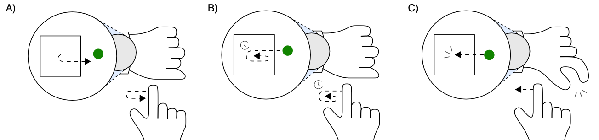
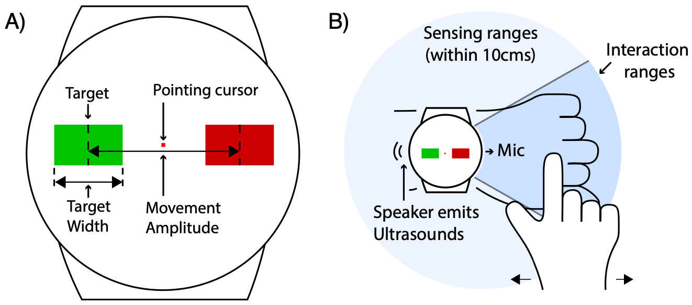

# SonarSelect

Cross, Dwell, or Pinch: Designing and Evaluating Around-Device Selection Methods for Unmodified Smartwatches.        
Jiwan Kim, Jiwan Son, and Ian Oakley    
CHI '25: Proceedings of the 2025 CHI conference on Human Factors in Computing systems.    
[DOI]() | [Video]()    

## About    

This open-source provides code for SonarSelect implementation.    

User can experience three different target selection methods for around-device interaction on unmodified smartwatches.    

1. Double-Crossing    
Double-crossing involves moving the cursor onto a rectangular target by crossing one of its edges. This highlights it as a candidate for selection. Moving the cursor out of the target by crossing the same edge confirms the selection, while, leaving the target by crossing another edge cancels the selection.    

2. Dwelling    
Dwell involves moving a cursor onto a target and remaining there for a predetermined period of time (500ms), after which selection is triggered.    

3. Pinching    
Triggering selection via a pinch of the index and thumb with the hand wearing the watch.   

This code is implementing binart target selection task described in Study 1. You can modify the number of blocks or repetition and target width or distance at Utilities.java. You also can adjust sensitivity of cursor movement by adjusting PEAK_THR or POWER_THR at RangeFinder.java.    

## Implementation    

1. Open SonarSelect project folder using Android Studio.   
2. Set appropriate sdk directory and sdk version following Gradle Scripts.   

## Credit

This work adapted LLAP implementation (https://github.com/Samsonsjarkal/LLAP) for low latency acoustic phase detection. 

## Reference
To appear